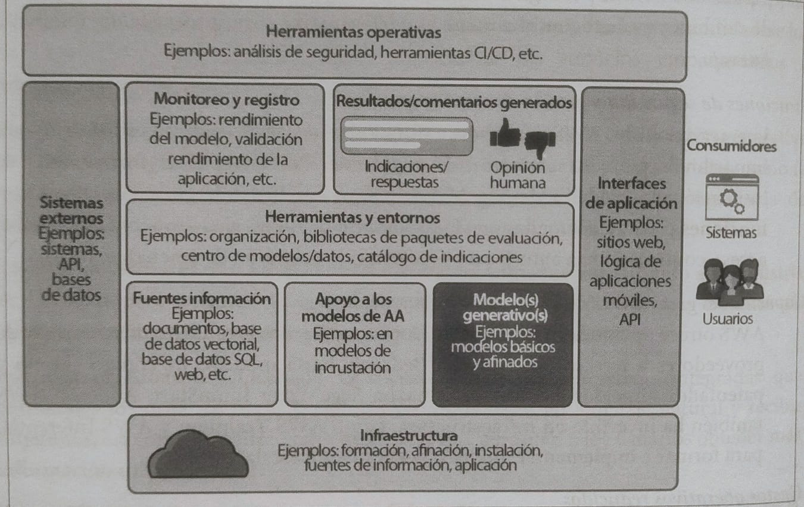
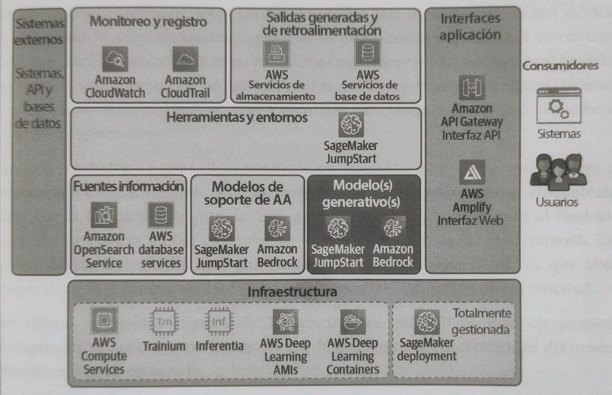
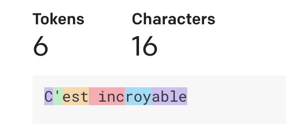
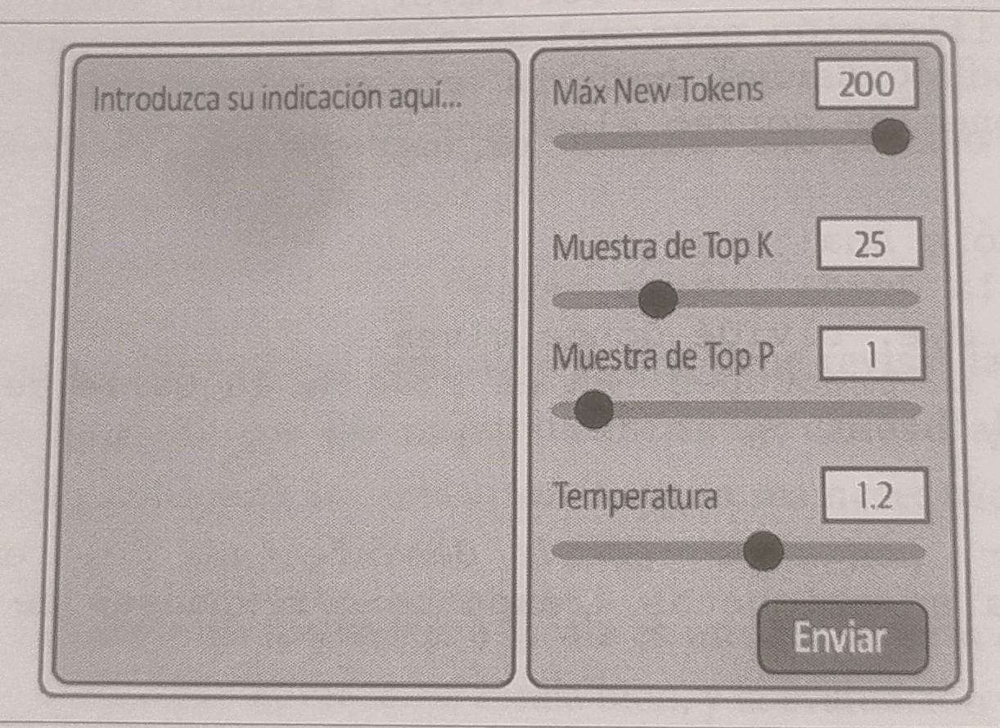
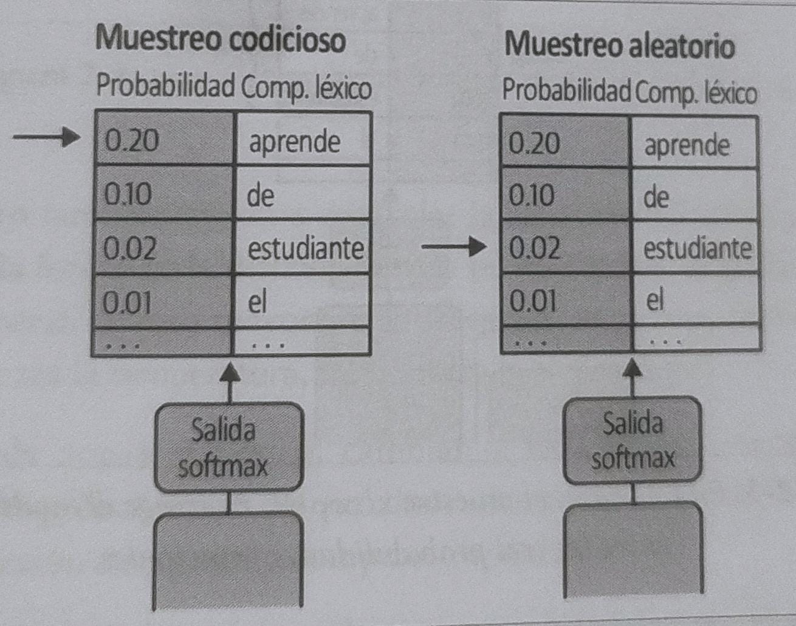
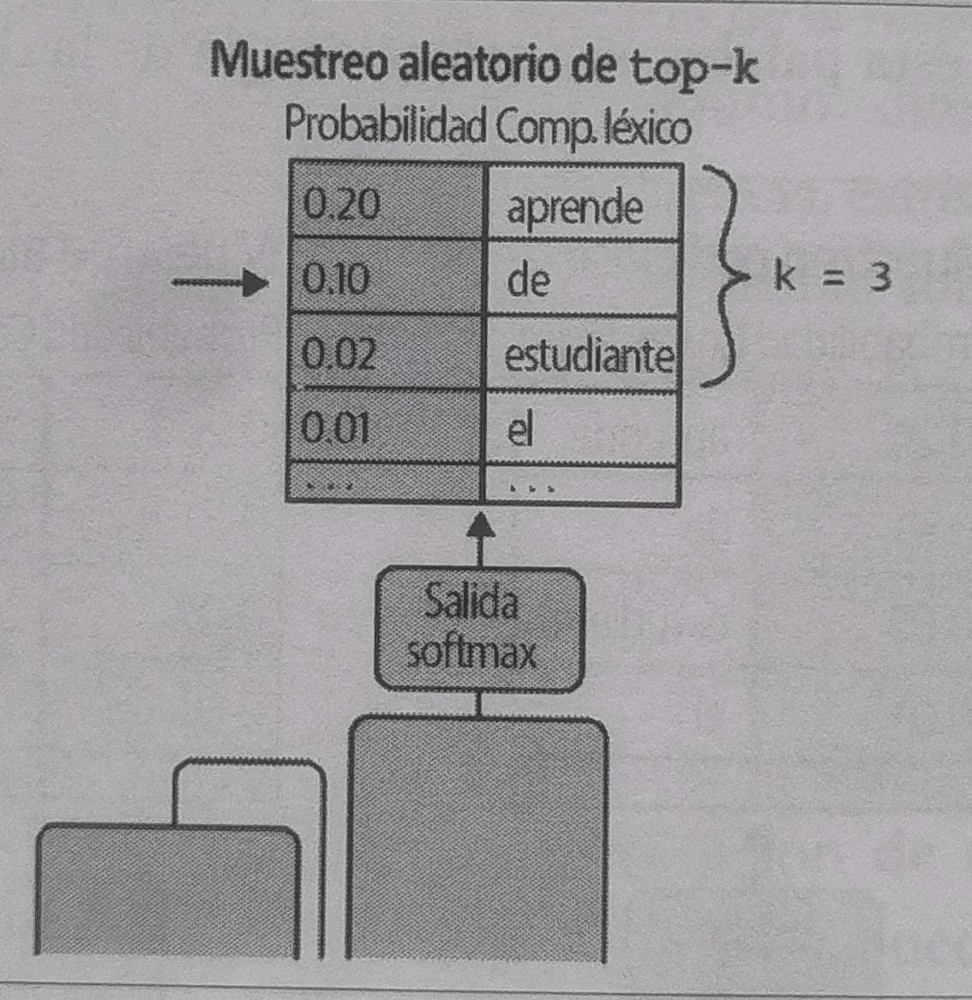
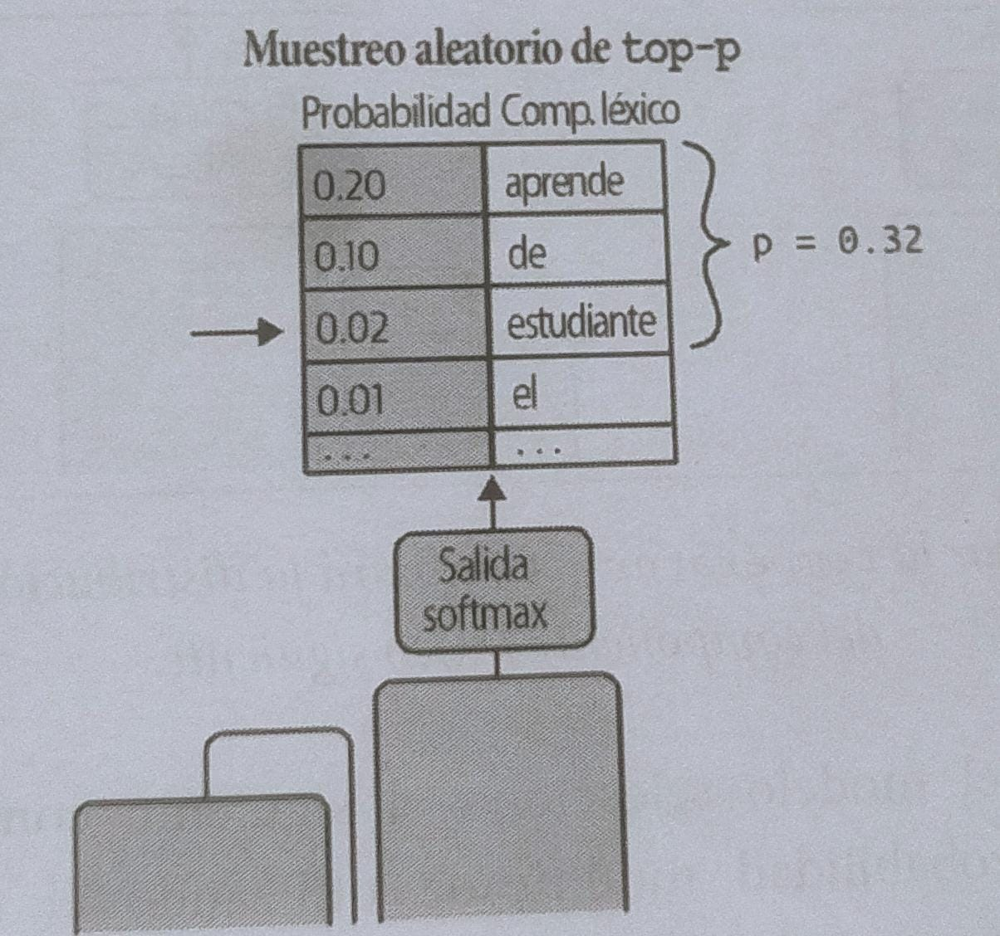
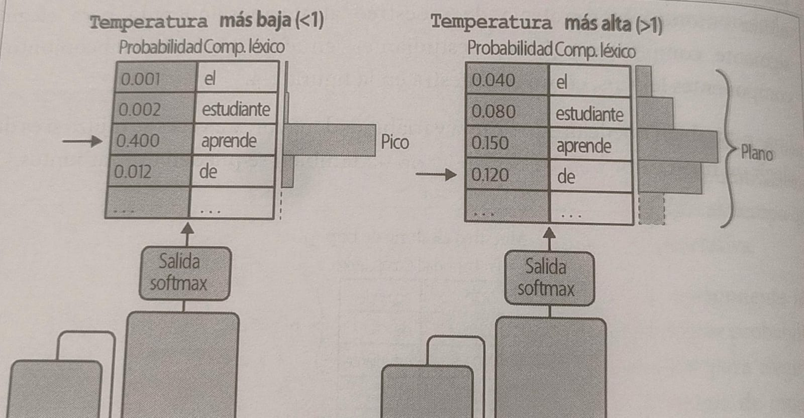

# RESUMEN GENERAL SOBRE IA GENERATIVA 

> 📖 Basado en el libro *IA Generativa en AWS* de Marbombo, autores: Chris, Antje y Shelbee.

## 1. CASOS DE USO DE LA IA GENERATIVA Y CICLO DE VIDA DEL PROYECTO

### Servicios AWS para IA 
- Bedrock
- SageMarker
- CodeWhispperer
- Trainium
- Inferentia

### Casos de uso
- Resumen texto
- Reescritura
- Extracción de información
- Respuesta a preguntas
- Detección de contenido tóxico o dañino
- Clasificación y moderación de contenido
- Interfaz conversacional
- Traducción 
- Generación de código fuente
- Razonamiento sobre un bosquejo dibujado a mano
- Enmascarar información personal identificable(PII)
- Marketing personalizado y anuncios

### Modelos básicos y centros de modelos
- Modelos de redes neuronales grandes y complejos (con cantidades enormes de parámetros).
    > 📌 **NOTA:**  Los parámetros aprenden en una etapa de aprendizaje llamada *preformación*, donde se utilizan grandes cantidades de datos distribuidos en CPU y GPU con lo cual al final estos pueden representar entidades complejas como el lenguaje humano, imágenes, vídeos y fragmentos de audio. 

### Fuentes de modelos de IA
- Hugging Face Model Hub
- Pythorch Hub
- Amazoz SageMaker JumpStart

### Ciclo de vida del proyecto de IA generativa
No existe un ciclo de vida definitivo para un proyecto de IA generativa, pero esto podría concentrar las etapas más importantes de un ciclo de proyecto IA.

    

- **Identifique caso de uso**
    Aquí se define el caso de uso, alcance y tarea específica con el fin de tener claro los objetivos, comprender el potencial y las limitaciones. 
- **Experimente y seleccione** 
    Se utilizan técnicas de *ingeniería de indicaciones* y *aprendizaje de contexto*. Inicie con un modelo básico existente y ajuste según la necesidad de la aplicación. Evalúe tamaño y recursos, probando distintas opciones en entornos como Amazon SageMaker, Hugging Face u otros para iterar rápido antes de escalar.
- **Adapte alinee y mejore** 
    Personalice el modelo al dominio específico y caso de uso, afinando datos y parámetros. Use técnicas como RLHF para alinearlo con valores y preferencias humanas, y compleméntelo con fuentes externas o APIs.
- **Evalúe** 
    Defina métricas claras para medir mejoras y alineación con metas empresariales. La evaluación continua durante la adaptación asegura que el modelo evolucione en la dirección correcta.
- **Instale e integre** 
    Implemente el modelo optimizando la inferencia y reduciendo latencia para mejorar la experiencia del usuario. Utilice instancias de AWS optimizadas para cargas generativas y puntos de conexión flexibles.
- **Monitoree**  
    Configure métricas y alertas con servicios como Amazon CloudWatch y CloudTrail para supervisar rendimiento y seguridad. Mantenga un control constante para ajustar y optimizar en producción.

### ¿Por qué IA generativa en la nube?

- **Mayor flexibilidad y elección**
    La nube ofrece la posibilidad de acceder a una amplia gama de servicios, modelos y herramientas para ajustarse a diferentes necesidades y casos de uso. Permite elegir el modelo adecuado para un proyecto y cambiarlo cuando sea necesario, aprovechando de forma continua las mejoras y nuevos modelos que aparecen.
- **Funciones de seguridad y gestión de nivel empresarial**
    Los proveedores de nube suelen integrar medidas avanzadas de seguridad y gestión para proteger datos, redes y accesos. Esto incluye cifrado, aislamiento de entornos, autenticación, autorización y detección de amenazas, lo que resulta esencial en sectores con altos requerimientos regulatorios. 

- **Capacidades generativas de última generación**
    Las plataformas en la nube facilitan el uso de modelos generativos de código abierto y propietario, así como herramientas para entrenamiento, ajuste fino e implementación a gran escala. Además, los proveedores invierten en infraestructura optimizada para IA, reduciendo los tiempos y costos de desarrollo.
- **Gastos operativos reducidos**
    Gracias a la infraestructura gestionada, la nube permite usar IA generativa sin tener que invertir en hardware propio, reduciendo gastos y simplificando la administración.
- **Un historial sólido de innovación continua**
    Las principales plataformas de nube mantienen un ritmo constante de innovación en inteligencia artificial, lanzando mejoras y nuevos servicios que ayudan a implementar soluciones más rápidas y eficientes.

### Creación de aplicaciones de IA generativa

Una aplicación de IA generativa incluye modelos generativos.

> 📌 **NOTA:** Generalmente, los proveedores de la nube ofrecen herramientas que empaquetan estas arquitecturas, como lo es CodeWhisper de AWS.

**Diagrama APP general**

**Diagrama APP ejemplo en AWS**

 

---

## 2. INGENIERÍA DE INDICACIONES Y APRENDIZAJE EN CONTEXTO 
Incluye métodos de código bajo para interactuar con modelos de IA generativa. *"Escribir indicaciones es tanto un arte como una ciencia"*.  
Aprendizaje en *contexto*: uso de pares de preguntas y respuestas.  
Ajuste de parámetros generativos, como la temperatura y *top-k*, para controlar la creatividad del modelo.
Componentes léxicos(tokens) de texto.

### Indicaciones y respuestas
Generalmente, las indicaciones se dan en texto y se da una respuesta en texto. En modelos multimodales, devuelve otro tipo de respuestas: la respuesta puede contener texto, imagen, audio o video. El modelo aprenderá a optimizar las respuestas para dar el mejor resultado.   

### Componentes léxicos
Los modelos de IA generativa entienden las instrucciones en contexto a través de tokens, en los cuales las palabras se fragmentan y combinan de diferentes maneras, integrando diversos componentes léxicos.

 

> **Token 🧩:** En el contexto de la inteligencia artificial y el procesamiento de lenguaje natural, un token es una unidad mínima de texto que el modelo utiliza para procesar y generar lenguaje.
Puede ser una palabra completa, parte de una palabra, un signo de puntuación o incluso un espacio, dependiendo del sistema de tokenización.
Los modelos transforman el texto en tokens para convertirlo en representaciones numéricas que pueden ser interpretadas y manipuladas mediante cálculos algebraicos y estadísticos.

> 📌 **Ventajas:**  Esta forma de estructurar el vocabulario permite que el modelo aprenda y comprenda el lenguaje humano durante la etapa de preentrenamiento. Además, facilita el cálculo de la respuesta, ya que esta es el resultado de operaciones algebraicas y estadísticas.

### Ingeniería de indicaciones 

Habilidad enfocada en comprender y aplicar modelos de IA generativa a tareas y casos de uso, con el objetivo de obtener el máximo provecho de los modelos y sus aplicaciones.
Generalmente, se itera múltiples veces antes de obtener la respuesta final, ya que los modelos suelen generar grandes volúmenes de texto.
La mayoría de los modelos de IA generativa han sido afinados con la ayuda de personas que etiquetan los resultados, en un proceso conocido como *aprendizaje por refuerzo*.

> **aprendizaje por refuerzo** 🎯 En inteligencia artificial, el aprendizaje por refuerzo es un enfoque en el que un agente aprende a tomar decisiones mediante la interacción con un entorno, recibiendo recompensas o penalizaciones según sus acciones.
En el caso de la IA generativa, este método se emplea para afinar modelos utilizando la retroalimentación de personas que evalúan y etiquetan las salidas del modelo, ajustando así su comportamiento para alinearlo con objetivos, valores o preferencias humanas.

En una charla es importante indicar las entradas, por ejemplo, del usuario como `Usuario:`, y para las salidas del modelo utilizar `Asistente:`. Esto le da una estructura clara que facilita la interacción.

### Estructura de indicaciones

Para mejorar la calidad de la respuesta de un modelo de IA generativa, es fundamental optimizar la estructura de la indicación.  
El modelo debe tener **clara la instrucción** y contar con **contexto suficiente** para interpretar correctamente la solicitud.

- **Instrucción:** Texto de entrada que describe de forma clara y precisa lo que se desea que el modelo realice.  
  Mientras más específica y detallada sea la instrucción, mejor será la calidad de la respuesta.

- **Contexto:** Información adicional y detalles relevantes que ayudan al modelo a comprender mejor la solicitud.  
  Este puede incluir datos previos, ejemplos o referencias específicas.

Además, se pueden incluir otros elementos para orientar la respuesta del modelo:

- **Tono:** Indica el estilo de comunicación que debe utilizar el modelo (formal, informal, técnico, amigable, persuasivo, etc.).

- **Restricciones:** Límites o condiciones que debe respetar la respuesta, como extensión máxima, uso de cierto vocabulario o evitar determinados temas.

### Inferencia con cero golpes
Pido al asistente: *“Escríbeme un haiku sobre la lluvia”*.  
No doy ejemplos, solo la instrucción, y espero la respuesta en el formato correcto.  

> 📌 **Descripción:** El modelo responde únicamente con lo aprendido en su entrenamiento, sin ejemplos adicionales.  
> Es útil cuando la tarea es sencilla o bien definida.  

### Inferencia con un golpe
Pido al asistente: *“Escríbeme un haiku sobre la lluvia”*  
y le muestro un ejemplo de la estructura:  

> *“Viejo estanque,  
salta una rana al agua,  
ruido de agua.”*  

> 📌 **Descripción:** El modelo recibe un ejemplo como referencia y lo usa para imitar la forma y el estilo esperados.  
> Es útil cuando se requiere un formato o tono específico.  

### Tipos de inferencia con ejemplos

**Inferencia con un solo golpe**
Se agrega una instrucción con un ejemplo de referencia.

Indicación:
Usuario: Responda utilizando el formato mostrado. ¿Quién ganó la serie mundial de béisbol en 2016?
Los Astros de Houston ganaron la serie mundial en 2022. Derrotaron a los Filis de Filadelfia.
¿Quién ganó la serie mundial de béisbol en 2016?

Respuesta: Los Cachorros de Chicago ganaron la serie mundial de 2016. Derrotaron a los Indios de Cleveland en siete partidos...

> 📌 **NOTA:** Respuesta más cercana a lo deseado, pero con demasiado detalle.

**Inferencia con pocos golpes**
Se proporcionan múltiples ejemplos para establecer un patrón claro.

**Cuando el aprendizaje sale mal**
Si se proporcionan ejemplos incorrectos, el modelo aprende temporalmente información errónea. Ejemplo: clasificar opiniones positivas como negativas y viceversa.

### Mejores prácticas de aprendizaje en contexto

- **Comience con cero golpes**, luego pruebe uno o pocos golpes si es necesario
- **Proporcione ejemplos consistentes** que representen bien el conjunto de datos
- **Límite: 5-6 ejemplos máximo**. Si necesita más, considere afinar el modelo
- **El aprendizaje en contexto varía** según el modelo utilizado

### Mejores prácticas de ingeniería de indicaciones

#### Estructura y claridad
- **Sea claro y conciso**: Evite ambigüedad. Si confunde a humanos, confundirá al modelo
- **Ser creativo**: Indicaciones reflexivas generan respuestas innovadoras
- **Instrucción al final**: Para textos largos, mueva la instrucción al final antes del indicador de salida

#### Especificaciones técnicas
- **Transmita el tema claramente**: Especifique quién, qué, dónde, cuándo, por qué, cómo
- **Directivas explícitas**: "Resuma en una sola frase" vs descripciones vagas
- **Evite formulaciones negativas**: Use "máximo 10 palabras" vs "no más de 10 palabras"
- **Especifique tamaño de respuesta**: Incluya límites de longitud específicos

#### Técnicas avanzadas
**Cadena de pensamientos (CoT)**
Para problemas complejos, agregue "piense paso a paso":

Indicación: ¿Qué vehículo necesita más pago inicial? (piense paso a paso)
Vehículo A: $40,000 con 30% inicial
Vehículo B: $50,000 con 20% inicial

Respuesta: Vehículo A necesita más pago inicial.
A: $40,000 × 30% = $12,000
B: $50,000 × 20% = $10,000
Por tanto, A requiere $2,000 más.

**Manejo de incertidumbre**
Defina qué hacer si el modelo no sabe: "Si no está seguro, responda 'No sé'"

**Restricciones de responsabilidad**
Para dominios especializados: "No tengo licencia médica. Consulte un profesional"

**Etiquetas XML/HTML**
Use `<text>...</text>` para estructurar indicaciones complejas y `<respuesta>...</respuesta>` para formatear salidas.

### Parámetros de configuración de inferencia

    

#### Parámetros principales

**Max new tokens**
- Limita componentes léxicos generados
- Controla longitud, no previene alucinaciones

**Estrategias de muestreo**
- **Muestreo codificioso**: Siempre elige palabra más probable (predeterminado)
- **Muestreo aleatorio**: Selección ponderada aleatoria, más natural

    

**Top-k**
Limita selección a los k componentes más probables. Si k=3, elige aleatoriamente entre las 3 opciones principales.

    

**Top-p**
Selecciona componentes cuyas probabilidades acumuladas no excedan p. Ejemplo: p=0.32 incluye componentes con probabilidades 0.30, 0.20, 0.10, 0.02.

    

**Temperatura**
Controla aleatoriedad modificando distribución de probabilidad:
- **Baja (<1)**: Más conservador, concentra probabilidades
- **Alta (>1)**: Más creativo, distribuye probabilidades uniformemente  
- **1**: Mantiene distribución original del modelo

    

> ⚠️ **Cuidado**: Temperatura muy baja = repeticiones. Temperatura muy alta = sin sentido.

### Resumen capitulo 2

La ingeniería de indicaciones combina arte y ciencia para optimizar respuestas de modelos generativos. Técnicas clave: indicaciones claras, ejemplos consistentes, cadena de pensamientos, y configuración apropiada de parámetros (temperatura, top-k, top-p). Estas técnicas no modifican pesos del modelo - para personalización profunda se requiere entrenamiento específico con datos propios.

---

## 3. MODELOS DE LENGUAJE GRANDES BÁSICOS

### Introducción a la formación previa
La formación de un modelo multibillonario de parámetros desde cero, llamada **formación previa**, requiere millones de horas de cálculo de GPU, billones de componentes léxicos de datos y mucha paciencia. En este capítulo se explorará cómo se forma un modelo básico, incluyendo los objetivos de formación y las leyes de escalamiento.

> 📌 **Ejemplo:** BloombergGPT requirió una gran cantidad de GPU de 1.3 millones de horas, fue formado con un gran grupo distribuido de instancias de GPU utilizando Amazon SageMaker.

### Modelos de lenguaje grandes básicos disponibles
Al comienzo de cualquier proyecto de IA generativa, primero debe explorar la gran cantidad de modelos básicos formados previamente, disponibles públicamente, que existen hoy en día, incluyendo las variantes del modelo Llama 2 de Meta que se utilizan en este libro.

Muchos modelos generativos han sido formados con datos públicos de Internet, con muchos idiomas y temas diferentes. Estos modelos generan una comprensión sólida del lenguaje humano, así como una cantidad de conocimientos en muchos dominios.

**Centros de modelos disponibles:**
- Hugging Face Model Hub
- PyTorch Hub  
- Amazon SageMaker JumpStart

**Datos de formación de BloombergGPT:**

| Fuente | Tamaño |
|--------|--------|
| **Datos financieros** | |
| Web | 42% |
| Noticias | 5% |
| Expedientes | 2% |
| Prensa | 1% |
| Bloomberg | 1% |
| TOTAL | 51% |
| **Otros datos (públicos)** | |
| C4 | 26% |
| Wikipedia | 20% |
| TOTAL | 49% |

### Analizadores léxicos
Cada modelo de IA generativa basado en lenguaje tiene un **analizador léxico** que convierte texto legible por seres humanos (por ejemplo, mensajes) en un vector que contiene identidades de analizadores léxicos (token_ids) o de las entradas (input_ids).

    

Cada input_id representa un componente léxico en el vocabulario del modelo.

> 📌 **NOTA:** input_ida en un montón de código fuente de aplicación de IA generativa, ya que estas son las representaciones numéricas de cada componente léxico. Una lista de estas son input_ids representa una pieza más grande de texto, como una frase, oración o párrafo.

### Vectores de incrustación
Los vectores de incrustación, a menudo llamados "incrustaciones", se han utilizado en el aprendizaje automático, la recuperación de información y los casos de uso de búsqueda durante décadas. Las incrustaciones son una representación numérica y vectorizada de cualquier entidad de cualquier tipo, incluyendo texto, imágenes, videos y archivos de audio, proyectada en espacios vectoriales de dimensión muy alta.

    

    

Para mayor simplicidad, usemos un espacio vectorial tridimensional simple en el cual cada incrustación sea un vector de tres valores proyectados en el espacio tridimensional. Aquí, puede ver que los componentes léxicos, como "enseñar" y "libro", están estrechamente relacionados, mientras que otros, como "coche" y "fuego", están más lejos.

### Transformadores
Lanzados en 2017, los transformadores están en el trono de la mayoría de los modelos de lenguaje modernos. De hecho, la "T" en BERT y GPT, dos arquitecturas lingüísticas muy populares, significa transformador.

    

**Componentes principales del transformador:**

#### Capa de incrustación
Se aprenden durante la preformación del modelo y, en realidad, son parte del transformador más grande. Cada componente léxico de entrada en la ventana contextual se asigna a una incrustación.

#### Codificador
Usualmente, el codificador codifica —o proyecta— secuencias de componentes léxicos de entrada en un espacio vectorial que representa la estructura y el significado de la oración. La representación de este espacio se aprende al preformar el modelo.

#### Autoservicio
Los transformadores utilizan un mecanismo llamado **autoatención** para atender a los componentes léxicos de interés mientras pasa por las entradas. La autoatención se utiliza para asistir a cada componente léxico con la entrada de datos y todos los demás componentes léxicos en la secuencia de entrada.

    

La atención por pares permite al modelo aprender las dependencias contextuales, o la comprensión contextual, entre todos los datos durante la formación previa del modelo.

**Mecanismo de atención:**
El transformador aprende en realidad conjuntos múltiples de pesos de autoservicio a través de la misma entrada y aprende aspectos diferentes del idioma. Cada cabeza funciona en paralelo sobre la misma entrada y aprende aspectos diferentes del idioma.

    

    

#### Decodificador
Los pesos de atención se pasan a través del resto de la red neuronal del transformador, independiente es el decodificador. El decodificador utiliza la comprensión contextual basada en la atención de los componentes léxicos de entrada para ayudar a generar nuevos componentes léxicos que, en última instancia, responden a la entrada proporcionada.

#### Salida softmax
La capa de salida softmax genera una distribución de probabilidad en todo el vocabulario del componente léxico, en la que se asigna a cada componente cierta probabilidad de ser seleccionado enseguida.

    

### Tipos de modelos básicos basados en transformadores
Hay tres variantes de modelos generativos basados en transformadores: **solo codificador**, **solo decodificador** y **codificador-decodificador**. Cada variante se forma con un objetivo de formación diferente y durante la formación previa se actualizan los pesos del modelo para minimizar la pérdida de los objetivos de formación descritos a continuación.

#### Modelos de solo codificador (autocodificadores)
Los modelos de solo codificador, o autocodificadores, se preforman mediante una técnica denominada **modelado de lenguaje enmascarado (MLM)**, que enmascara aleatoriamente los componentes léxicos de entrada e intenta predecir cuáles son enmascarados.

    

**Objetivo:** Reconstruir el texto (eliminación de ruido)
**Características:** Utilizan representaciones bidireccionales de la entrada para comprender mejor el contexto completo de un componente léxico.

#### Modelos de solo decodificador (autorregresivos)
Los modelos de solo decodificador, o modelos autorregresivos, se preforman utilizando un **modelo lingüístico causal unidireccional (CLM)**, que predice el componente léxico siguiente usando solo los componentes léxicos anteriores.

    

**Objetivo:** Predecir el siguiente componente léxico
**Características:** Solo revelan los componentes léxicos que conducen al que se predice.

**Modelos populares:** GPT-3 Falcon y LLaMA son modelos autorregresivos bien conocidos.

> 📌 **NOTA:** Meta cambió el caso del nombre del modelo Llama cuando lanzó Llama 2. La primera versión utiliza el caso mixto (LLaMA), que es un acrónimo de Large Language Model Meta AI (Modelo de lenguaje grande para IA de Meta). La segunda versión utiliza el caso del título (Llama 2).

#### Modelos de codificador-decodificador (secuencia a secuencia)
Los modelos de secuencia a secuencia, originalmente diseñados para la traducción, también son muy útiles para tareas de resumen de texto. T5 y su hermano con ajuste fino, FLAN-T5, son modelos bien conocidos de codificador-decodificador, secuencia a secuencia, utilizados en un número amplio de tareas de lenguaje generativo.

    

**Objetivo:** Reconstrucción del tramo
**Características:** Utilizan tanto el transformador codificador como el decodificador.

### Conjuntos de datos para formación previa
Un modelo generativo aprende las funciones durante la fase de formación previa, cuando se ve una gran cantidad de datos de formación, a menudo en la escala de terabytes y petabytes. Los conjuntos de datos a menudo provienen de Internet (datos públicos), pero también pueden incluir datos privados de los depósitos o bases de datos privadas de Amazon S3.

**Conjuntos de datos populares:**
- **Wikipedia y Common Crawl**: Wikipedia ofrece un extracto multilingüe de su contenido de 2022, mientras que Common Crawl es un registro mensual de texto que se encuentra en todo Internet.
- **Colossal Clean Crawled Corpus (C4)**, **The Pile** y **RefinedWeb**: Intentan limpiar los datos para una formación de modelos de mayor calidad.

> 📌 **NOTA:** La familia de modelos Falcon fue formada con 1.5 billones de componentes léxicos de datos llamados RefinedWeb. Los datos se procesaron en un grupo de 257 instancias ml.c5.18xlarge de SageMaker, compuesto por 18 504 CPU y 37 TB de RAM de CPU.

### Leyes de escalamiento
Para los modelos generativos, ha surgido un conjunto de **leyes de escalamiento** que describen las compensaciones entre el tamaño del modelo y el del conjunto de datos para un presupuesto informático fijo (por ejemplo, el número de horas de GPU).

    

    

Estas leyes de escalamiento establecen que puede lograr un mejor rendimiento del modelo generativo aumentando el número de componentes léxicos o el número de parámetros del modelo.

### Modelos informáticos óptimos
En 2022, un grupo de investigadores publicó un artículo que comparaba el rendimiento del modelo de varias combinaciones de modelos y tamaños de conjuntos de datos. Dado que los autores nombraron el modelo final de informatización óptima Chinchilla, este artículo es conocido como el **artículo Chinchilla**.

El artículo Chinchilla implica que los modelos enormes, de parámetros de más de 100 mil millones, como el GPT-3, pueden estar sobreparametrizados y poco formados. Además, plantean la idea de que se podría lograr un rendimiento de más de 100 mil millones de parámetros con un modelo pequeño simplemente proporcionando más datos de formación al modelo más pequeño.

**Leyes de escalamiento de Chinchilla:**

| Modelo | Tamaño del modelo (parámetros) | Tamaño óptimo del conjunto de datos (componentes léxicos) | Tamaño real del conjunto de datos (componentes léxicos) | Hipótesis |
|--------|-------------------------------|----------------------------------------------------------|-------------------------------------------------------|-----------|
| Chinchilla | 70 B | 1.4 T | 1.4 T | Cálculo óptimo (20×) |
| LLaMA-65B | 65 B | 1.3 T | 1.4 T | Cálculo óptimo (20×) |
| GPT-3 | 175 B | 3.5 T | 300 B | Sobreparametrizado para el tamaño del conjunto de datos (~20×) |
| OPT-175B | 175 B | 3.5 T | 180 B | Sobreparametrizado para el tamaño del conjunto de datos (~20×) |
| BLOOM | 176 B | 3.5 T | 350 B | Sobreparametrizado para el tamaño del conjunto de datos (~20×) |
| Llama2-70B | 70 B | 1.4 T | 2.0 T | Mejor que el cálculo óptimo (~20×) |

> 📌 **NOTA:** Los modelos de más de 175 mil millones deben ser formados con 3.5 billones de componentes léxicos. En cambio, fueron formados con 180-350 mil millones de componentes léxicos, un orden de magnitud menor de lo recomendado.

El modelo más reciente de Llama 2 de 70 mil millones de parámetros, que fue lanzado después del documento Chinchilla, fue formado con 2 trillones de componentes léxicos, mayor que la relación de 20 componentes léxicos a 1 parámetro descrita por el documento. Llama 2 superó al modelo original de LLaMA basado en varios puntos de referencia, incluyendo la comprensión masiva del lenguaje multitarea (MMLU).

### Resumen
En este capítulo, se vio cómo los modelos básicos se forman usando cantidades grandes de texto durante la etapa inicial de formación, llamada **formación previa**. Aquí es donde el modelo desarrolla su comprensión del lenguaje.

También aprendimos tres tipos diferentes de modelos de lenguaje basados en transformadores: de **solo codificador** (autocodificación), de **solo decodificador** (autorregresivo) y de **codificador-decodificador** (secuencia a secuencia).

Además, se exploraron las **leyes de escalamiento** que ayudan a los investigadores a elegir el número de parámetros del modelo y el tamaño del conjunto de datos para un presupuesto informático determinado al preparar un modelo básico desde cero.